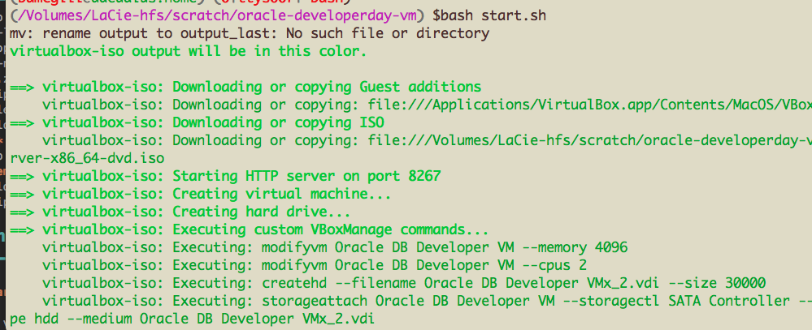

Oracle Developer Day VM Builder
===============================

Welcome to the packer build for the Oracle Developer Day vm.  
This will build a Oracle Linux server and install a 12.2 Oracle database on the machine.  Follow the download instructions to download the software to install and follow the build instructions to build the machine.  You will need around 30gb of space free to store the downloads and run the build.

There are several directories which are used in the build

1. put_files_here - place ALL downloaded software here
2. output - The resultant VirtualBox OVA will be placed here
3. upload - This directory has all the install scripts for the downloaded software.  

Mandatory Downloads
-------------------
**These two downloads are mandatory**.  If they are not here, the build will not start.

* OracleLinux-R7-U3-Server-x86_64-dvd.iso (needs to be this exactly md5 checked)
* linux\*122*_database.zip (12201 has been verified - silent install may be incompatible with later versions)

Optional Downloads
--------------
If these files are available in the **put_files_here** directory, the build will try and install them.  

* jdk-8u\*-linux-x64.tar.gz - **Oracle JDK**
* sqldeveloper-\*-no-jre.zip - **Oracle SQL Developer**
* datamodeler-\*-no-jre.zip **Oracle SQLDeveloper Data Modeler**
* sqlcl-\*-no-jre.zip - **Oracle SQLcl**
* apex_5\*.zip - **Oracle Application Express**
* ords\*.zip - **Oracle REST Data Services** 
 
Oracle Internal Files
---------------------
These files may not be available publicly

* demos.zip - **Oracle Hands on Labs demos**
* reset_xmldbjson ** Reset XMLdb demos**
* master.zip - **Oracle Sample Schema**
* mozillablob.zip - **firefox .mozilla for (json viewer) plugins and or bookmarks**
* storm.zip - **exp dump of non sensative material. For geo location optional demo.**

Build Instructions
------------------

>**bash start.sh "http://and_proxy_as_first_arg_if_wanted" export**

NOTE Proxy value will be in the logs from bash set -x stored in ~oracle/log 
If you are inside a VPN, the proxy settings allow the VM to contact yum
update servers. optional export to export the ova.

Output Directory
----------------

After building you can find the built OVA in the output directory.
If you want the Oracle prebuilt OVA you can find it on Oracle Technology Network (OTN) [here](http://www.oracle.com/technetwork/database/enterprise-edition/databaseappdev-vm-161299.html)

Build Structure
--------------------

1. 1updateLinux.sh PROGRESS: 1/4 1updateLinux.sh - first script run - from plain iso. Set up second drive. Yum Updates. Reboot
2. 2afterFirstReboot.sh  PROGRESS: 2/4 2afterFirstReboot.sh - after first reboot - before any oracle database software installed. install virtual box guest additions.
3. 3topLevel.sh PROGRESS: 3/4 3topLevel.sh - main kick off script e.g. yum and call subscripts
4. 3_1installDbtoolClientTools.sh PROGRESS: 3_1/4 3_1installDbtoolClientTools.sh - install dbtools client tools
5. 3_2installDatabase.sh PROGRESS: 3_2/4 3_2installDatabase.sh - install the database with silent install
6. 3_3passwordDoNotExpire.sh PROGRESS: 3_3/4 3_3passwordDoNotExpire.sh - Database post install updates - e.g. passwords do not expire.
7. 3_4enableGeoRaster.sh PROGRESS: 3_4/4 3_4enableGeoRaster.sh - post database install and patches (if required)
8. 3_5unzipLabDemos.sh PROGRESS: 3_5/4 3_5unzipLabDemos.sh - demos (labs)
9. 3_6apexInstall.sh PROGRESS: 3_6/4 3_6apexInstall.sh - apex install
10. 3_7ORDSInstall.sh PROGRESS: 3_7/4 3_7ORDSInstall.sh - ords install
11. 3_8setupDemos.sh PROGRESS: 3_8/4 3_8setupDemos.sh - set up demos and run reset scripts
12. PROGRESS: END OF SCRIPT: 4/4 for tracing information see local file log.zip

Timings:

Minimum (Oracle Linux + Oracle Database)  
Total time 60 mins (accounted for time + 7 mins rounding error / ignore <2 minute).  
